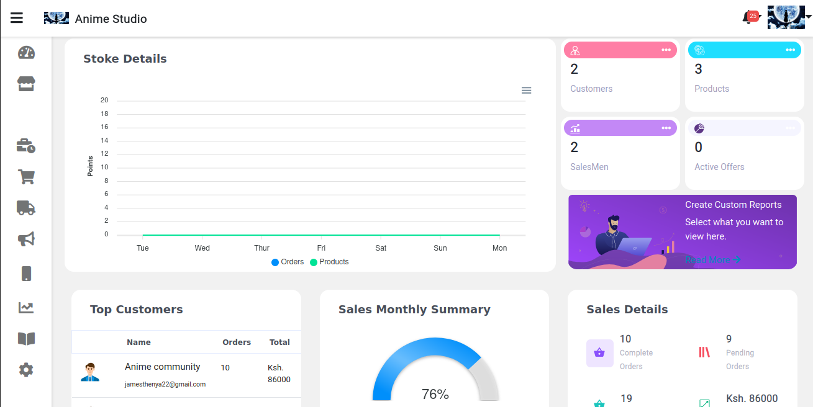
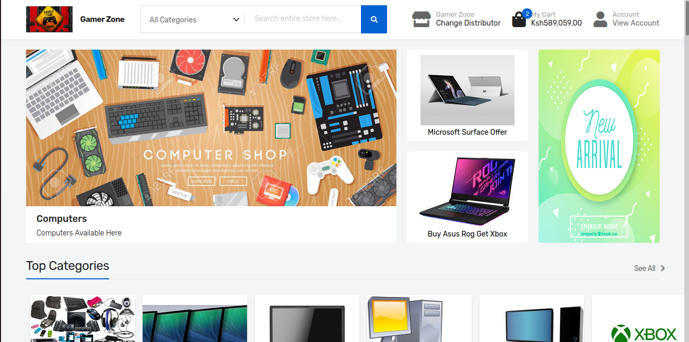
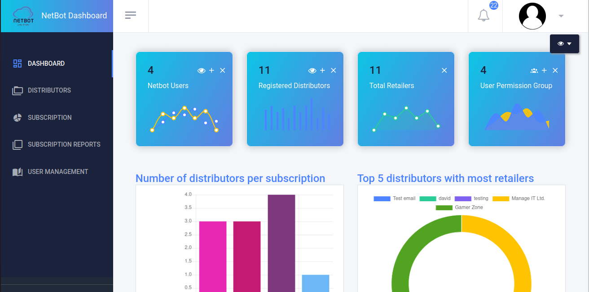

## General Information

The project is designed to enhance the order placement process by allowing retailers to place orders directly with distributors through a dedicated web login and a mobile app specifically built for them. This system addresses key challenges in supply chain management and retail automation by giving retailers real-time access to product availability, inventory tracking, and order status updates. Initiated in 2023, the project’s primary goal is to streamline the supply chain from distributors to retailers, enabling faster, more accurate order fulfillment. By reducing the reliance on manual processes and providing retailers with greater control and transparency, this solution optimizes the supply chain workflow, ensures timely restocking, and ultimately boosts the overall efficiency of retail operations. With both web and mobile platforms, retailers can manage their orders on the go, ensuring they never miss an opportunity to keep their inventory fully stocked.

## Technologies Used

- Django - version 3.2
- Node js - version 14.7
- Bash scripts - version 5.0

## Features

List the ready features here:

- Scm Panel
- Customers Panel
- Admin View

## Screenshots

<!-- If you have screenshots you'd like to share, include them here. -->

